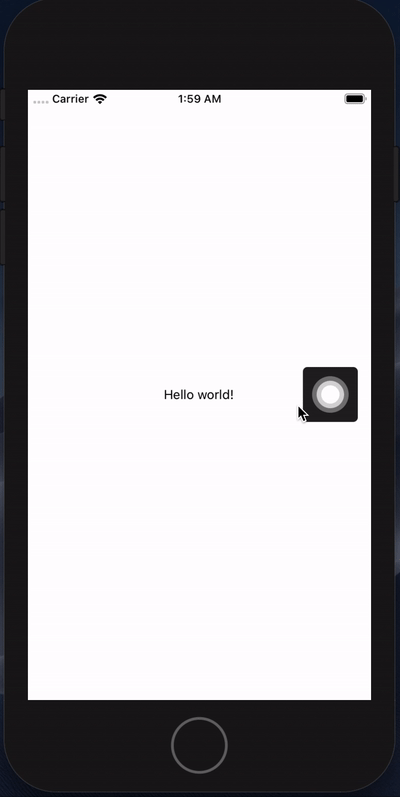

# React Native AssitiveTouch Component Like IPhone


## :star: ScreenShot



## :arrow_down: Installation

#### Install from npm

```sh
npm install --save react-native-assitive-touch
```


#### Import AssitiveTouch (Step 2)

```sh
import AssitiveTouch from "react-native-assitive-touch";
```

#### AssitiveTouch component must wrap your app  (Step 3)

```sh
const App = () => {
  return (
    <AssitiveTouch
      onPress={() => console.log('Assitive Button is clicked!')}
      >                  
      <View style={{flex: 1, alignSelf: 'stretch'}}>
        {/* Your App */}                 # Your app other components here
      </View>
    </AssitiveTouch>
  );
};
```

##  Config

| Params | Type | Default | Description |
| --- | --- | --- | --- |
| size | Number | 70 | Size of the button |
| button | ReactNode | - | Your custom button component (equal or smaller than size) |  
| color | String | #212121 | Button color |
| percentage | Float | 0.2 | Percantage of vertical swipe field |

##  Methods

| Name | Description |
| --- | --- |
| onPress | Run on press the default assitive touch button |
| onMoveEnd | Run at the end of the assistive touch move |


## :warning: Dependency

### Note on the legacy CLI
There seems to be quite some confusion about the legacy CLI. This template only works with the new CLI. Make sure you have uninstalled the legacy `react-native-cli` first (`npm uninstall -g react-native-cli`), for the below command to work. If you wish to not use `npx`, you can also install the new CLI globally (`npm i -g @react-native-community/cli` or `yarn global add @react-native-community/cli`).
